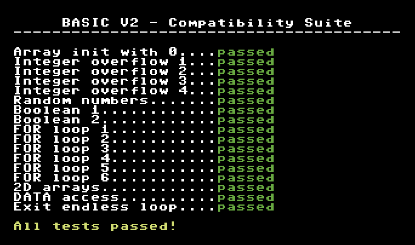

# BASIC V2 Compatibility Suite

This project contains a Commodore 64 BASIC V2 compatibility test suite used to validate compiler/runtime behavior across a set of edge-cases.

## Project Contents

- `src/compsuite.bas` - Main BASIC V2 compatibility suite with 17 tests.
- `src/timer.asm` - Assembly routine used by the suite to detect endless loops.
- `compsuite.d64` - Disk image containing the suite.
- `results.md` - Formatted Markdown version of the result summary.

## Test Coverage

The suite includes checks for:

- Array initialization
- Infinite loop exit behavior
- Integer overflow handling
- Random number behavior
- Boolean expression evaluation
- Complex `FOR`/`NEXT` loop flow
- 2D array indexing
- `DATA` read/access behavior

## Results

- Formatted report: [results.md](results.md)

## License

See `LICENSE.txt`.
